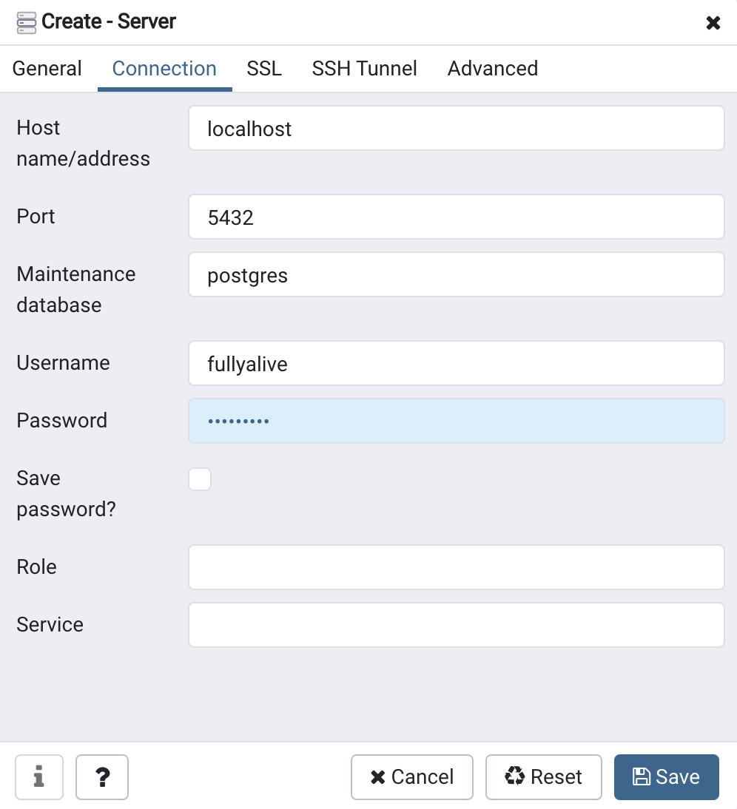

# **환경설정**

[모두를 위한 SQL/DB](https://www.fastcampus.co.kr/data_online_sqldb) 강의 수강을 위한 환경설정

postgresql, pgAdmin4, DBeaver를 사용
- Mac OS가 Catalina(10.15이상)인 경우 postgreSQL 12.2 버전 설치가 필요
- [설치영상](https://www.youtube.com/embed/rTvwWbZEfkE)


install postgresql

``` brew install postgresql ``` 

start postgresql server

``` brew services start postgresql```

kill postgresql server

``` brew services stop postgresql ```

버전확인

``` psql -V ``` or ``` postgress -V ```

``` psql postgres ```

---

슈퍼유저 생성

``` CREATE USER ID PASSWORD 'PASSWORD' SUPERUSER;```


유저가 생성 되었는지 확인

``` \du ```


슈퍼유저 비밀번호 설정

``` CREATE DATABASE study_sql OWNER fullyalive ```


---

전체 DB 리스트 조회하기

``` \l ```


생성한 DB를 pgAdmin4에 연결하기
- [pgAdmin4 download link](https://www.postgresql.org/ftp/pgadmin/pgadmin4/v4.21/macos/)


Browser에 있는 Servers 우클릭 > Server


서버 이름 입력


Host: localhost, Username과 Password는 db를 생성한 ID로 넣어준다


