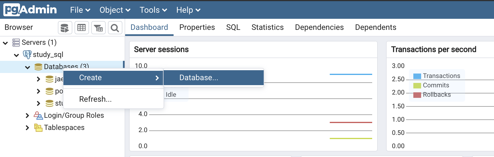
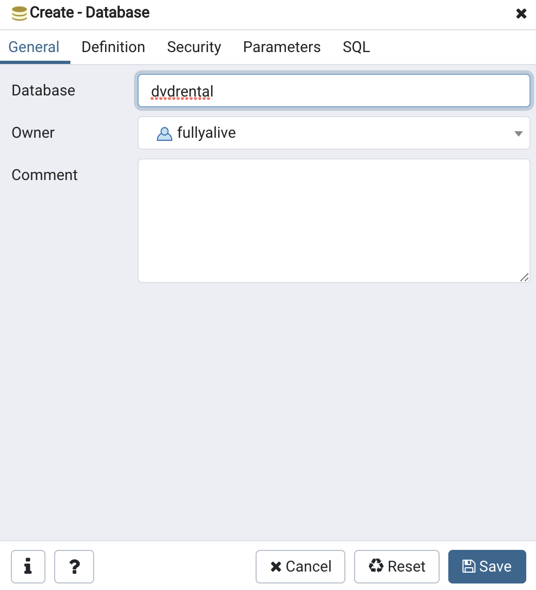
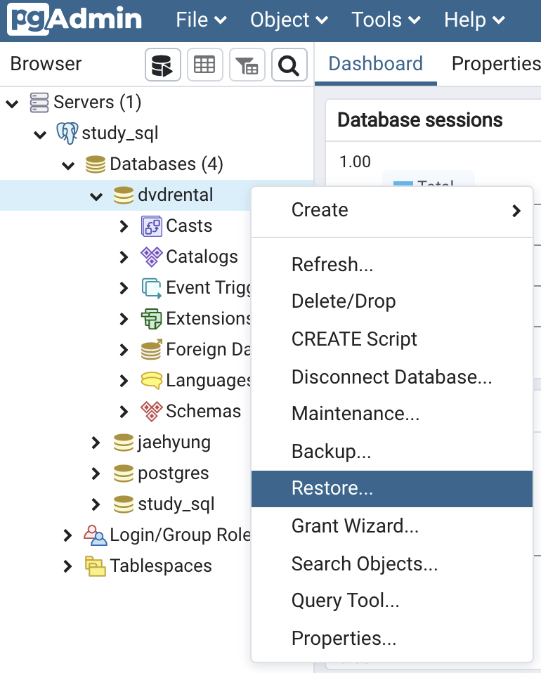
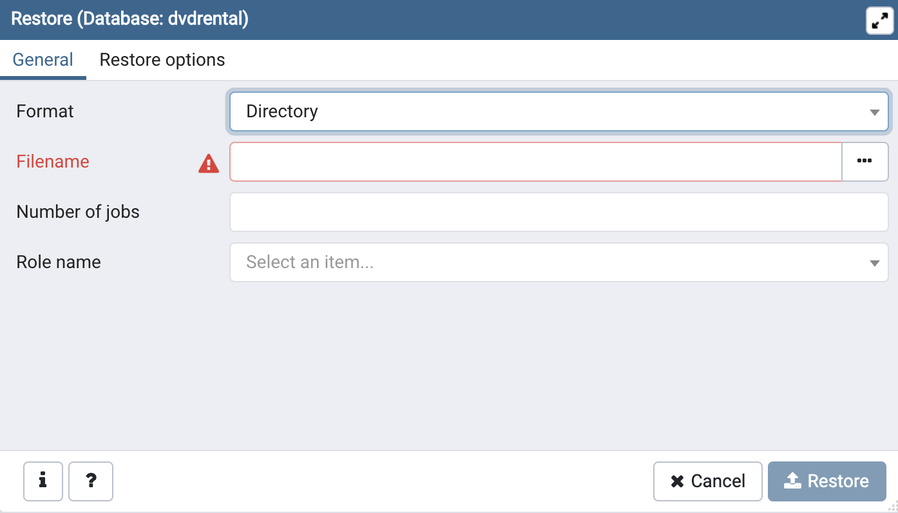
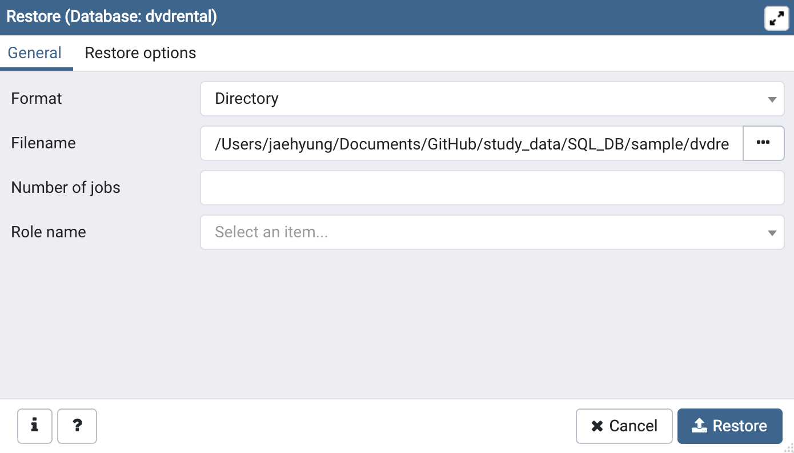
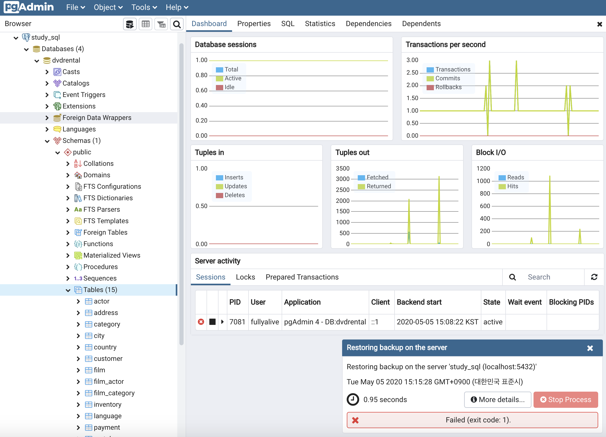
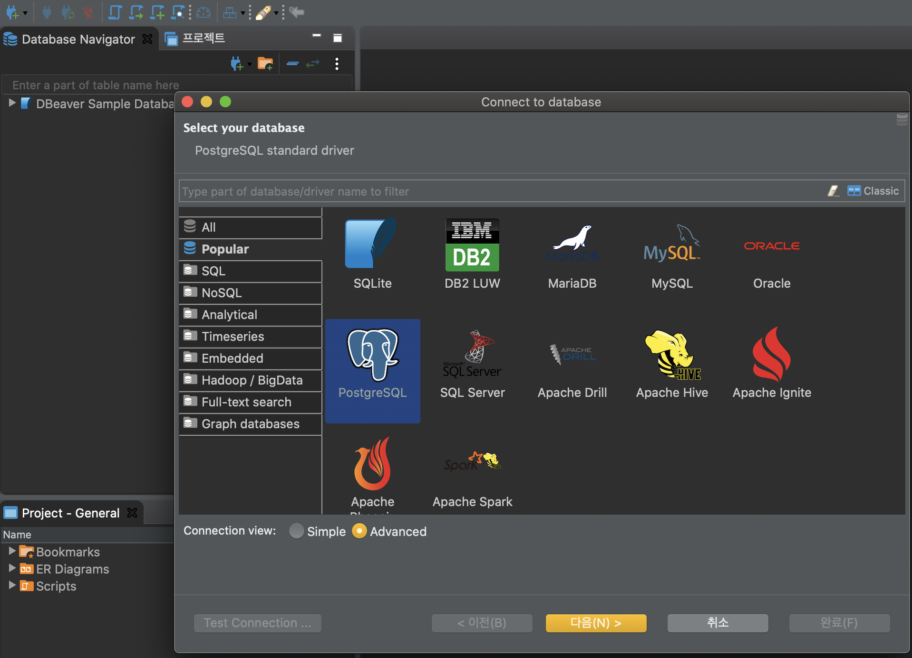
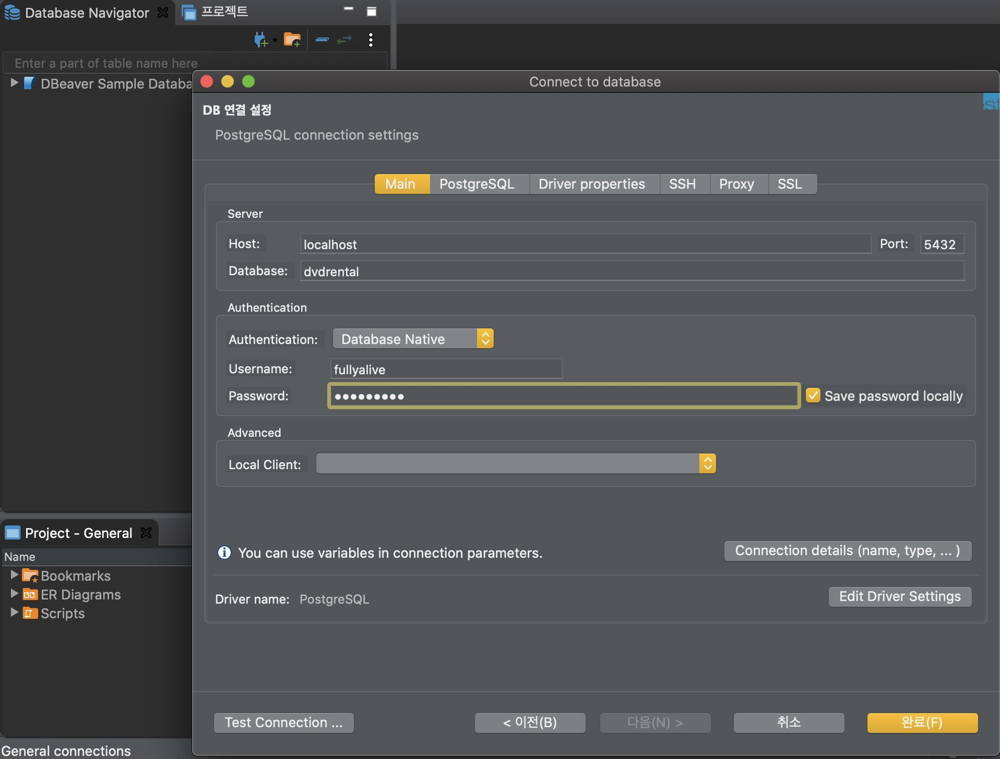
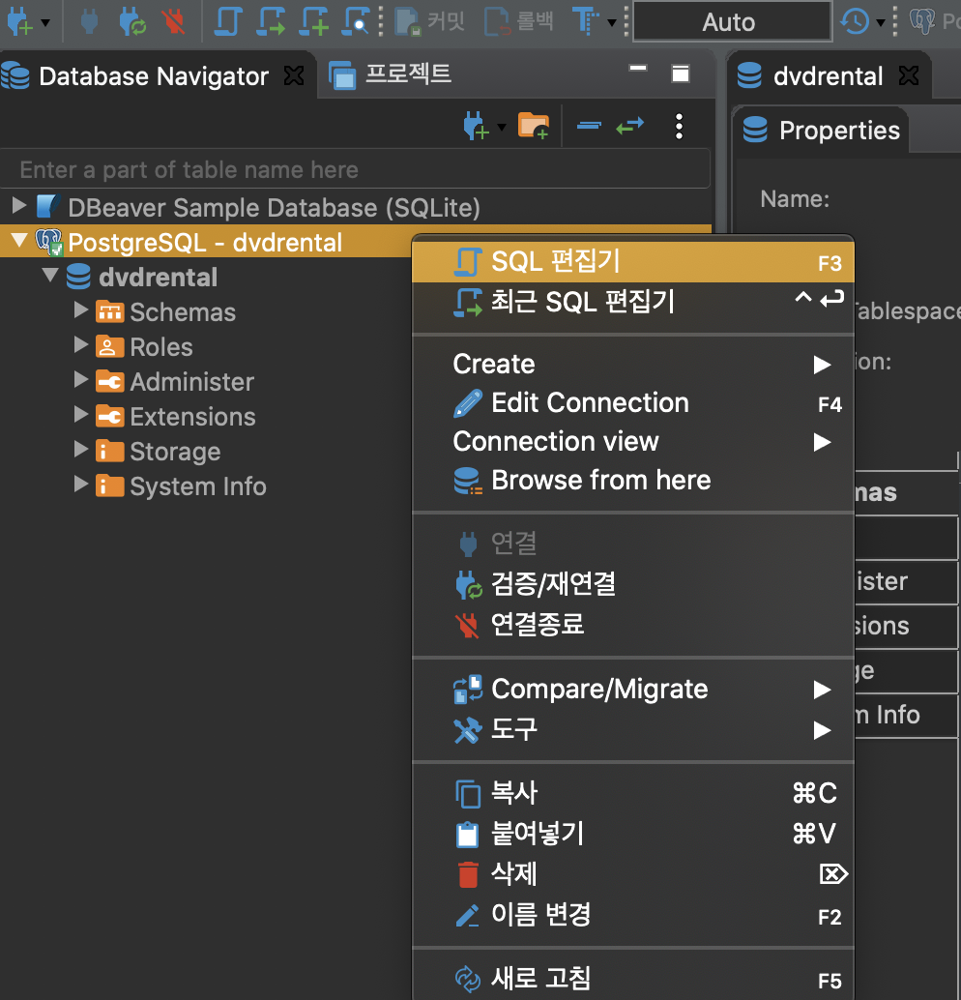
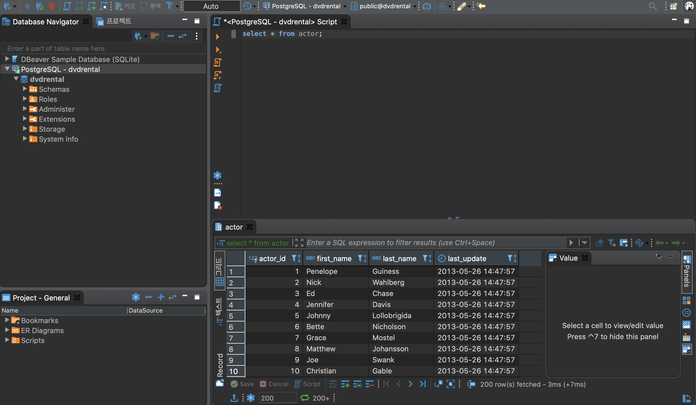

# **DBeaver환경에서 Sample DB Restore**


환경설정을 마무리하고 나서 컴퓨터를 껐다 켰는데 아래 오류 발생
```
psql: error: could not connect to server: could not connect to server: No such file or directory
	Is the server running locally and accepting
	connections on Unix domain socket "/tmp/.s.PGSQL.5432"?
```
#### 에러 해결 방법

데이터베이스가 돌아가는 중인지 확인

``` ps -ef | grep postgres ```


```
$ brew services stop postgresql
$ rm /usr/local/var/postgres/postmaster.pid # adjust path accordingly to your install
$ brew services start postgresql
```

### Sample DB in pgAdmin4

[Sample DB 다운로드](https://www.postgresqltutorial.com/postgresql-sample-database/)

pgAdmin4 실행이 안되면 아래 커맨드 입력 후 재실행

``` killall pgAdmin4 ``` 


create Database


name Database


Restore


디렉토리 지정



dvdrental > Schemas > tables 내 생성된 테이블 확인


### Sample DB in DBeaver









option + X 로 실행가능

