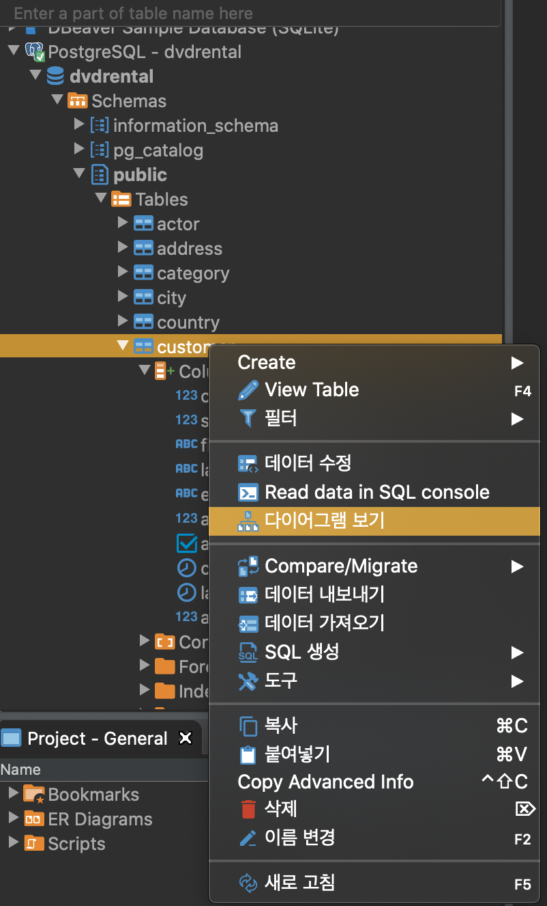
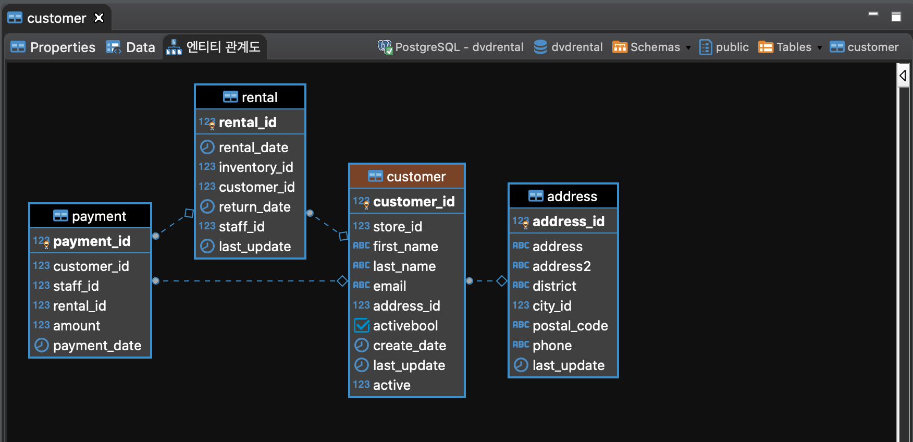
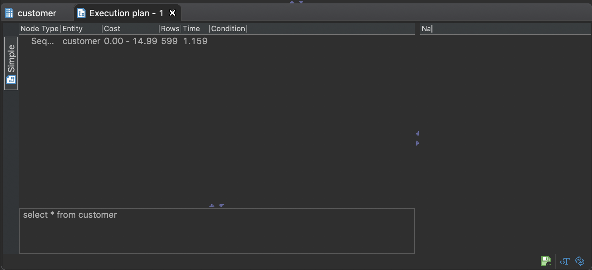

# **SELECT**

```
SELECT 
    COLUMN_1    -- 추출 대상 컬럼
    ,COLUMN_2   -- 테이블의 모든 컬럼을 보고 싶을 때는 *
    ,...
FROM
    TABLE_NAME  -- 추출 대상 테이블명 입력
;               -- 세미콜론으로 끝남
```








Command + Shift + E => 실행계획

### ALIAS(별칭)

postgresql은 별칭 생성을 위해 예약어 ```AS``` 생략 가능

또한 별칭에 공백이 있을시 ``` "alias blabla" ``` 와 같이 double quote로 지정

테이블 별칭의 일반적인 사용은 긴 테이블 이름 단축 식별자를 할당하여 조인 절을 쉽게 작성하는 것

- 가독성
- 저비용


```
SELECT
    C.FIRST_NAME
    ,C.LAST_NAME
    ,C.EMAIL
FROM
    CUSTOMER C
;
```