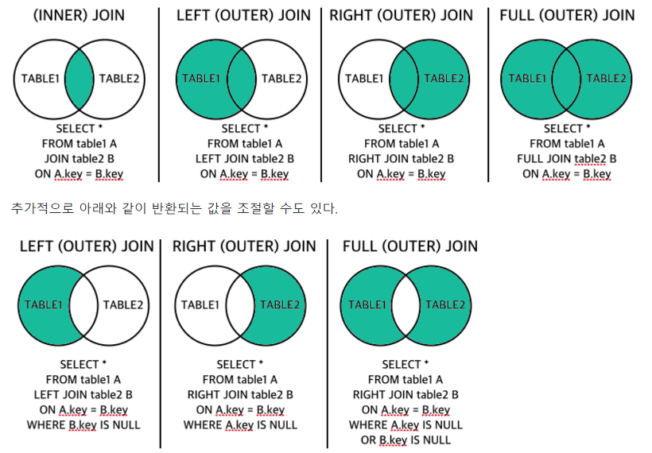

# **JOIN**

2개 이상의 테이블에 있는 정보 중 사용자가 필요한 집합에 맞게 가상의 테이블처럼 만들어서 결과를 보여주는 것



| 종류            | 설명                                                                                                                     |
| --------------- | ------------------------------------------------------------------------------------------------------------------------ |
| INNER 조인      | 특정 컬럼을 기준으로 정확히 매칭된 집합을 출력                                                                           |
| OUTER 조인      | 특정 컬럼을 기준으로 매칭된 집합을 출력하지만 한쪽의 집합은 모두 출력하고 다른 한쪽의 집합은 매칭되는 컬럼의 값만을 출력 |
| SELF 조인       | 동일한 테이블끼리의 특정 컬럼을 기준으로 매칭되는 집합을 출력                                                            |
| FULL OUTER 조인 | INNER, LEFT OUTER, RIGHT OUTER 조인 집합을 모두 출력                                                                     |
| CROSS 조인      | Cartesian Product이라고도 하며 조인되는 두 테이블에서 곱집합을 반환                                                      |
| NATURAL 조인    | 특정 테이블의 같은 이름을 가진 컬럼간의 조인집합을 출력                                                                  |

#### BASKET_A 테이블 생성
```
CREATE TABLE BASKET_A
(
	ID INT PRIMARY KEY,
	FRUIT VARCHAR (100) NOT NULL
)
```

#### 데이터 저장후 커밋
```
INSERT INTO BASKET_A
(ID,FRUIT)
VALUES
(1,'APPLE'),
(2,'ORANGE'),
(3,'BANANA'),
(4,'CUCUMBER');

COMMIT;
```

#### BASKET_B 테이블 생성
```
CREATE TABLE BASKET_B
(
	ID INT PRIMARY KEY,
	FRUIT VARCHAR (100) NOT NULL
)
```

#### 데이터 저장 후 커밋
```
INSERT INTO BASKET_B
(ID,FRUIT)
VALUES
(1,'ORANGE'),
(2,'APPLE'),
(3,'WATERMELON'),
(4,'PEAR');

COMMIT;
```

 COMMIT AUTO 설정시 활용 메뉴
