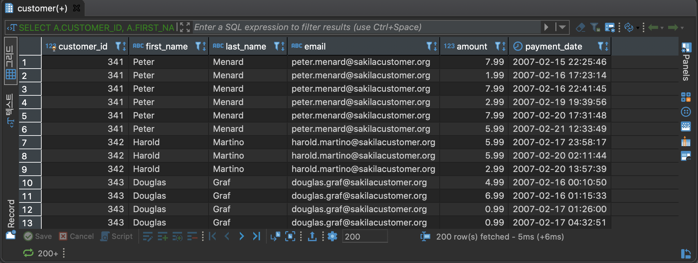
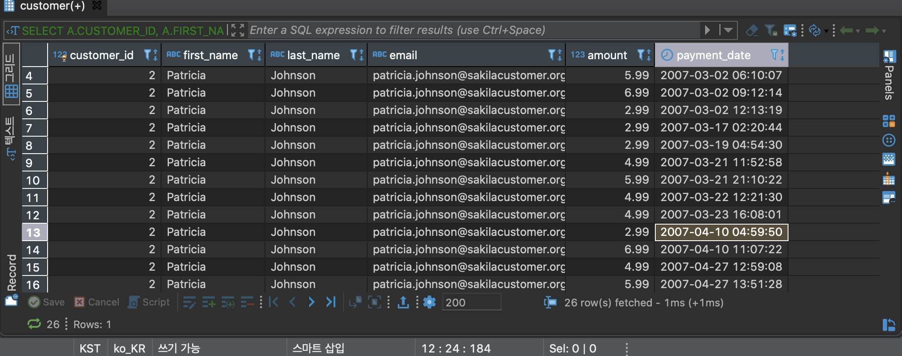
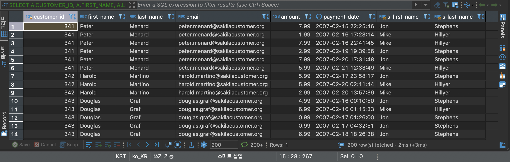

# **INNER JOIN**

특정 컬럼을 기준으로 정확히 매칭된 집합을 출력. INNER JOIN은 대표적인 JOIN 종류


---

#### FRUIT 컬럼을 기준으로 A테이블과 B테이블의 데이터를 조회

```
SELECT
	A.ID ID_A,
	A.FRUIT FRUIT_A,
	B.ID ID_B,
	B.FRUIT FRUIT_B
FROM
	BASKET_A A
INNER JOIN BASKET_B B ON
	A.FRUIT = B.FRUIT;
```

#### CUSTOMER 테이블과 PAYMENT 테이블을 CUSTOMER_ID 기준으로 조인하여 데이터 조회

```
SELECT
	A.CUSTOMER_ID,
	A.FIRST_NAME,
	A.LAST_NAME,
	A.EMAIL,
	B.AMOUNT,
	B.PAYMENT_DATE
FROM
	CUSTOMER A
INNER JOIN PAYMENT B ON
	A.CUSTOMER_ID = B.CUSTOMER_ID
```

고객은 여러건의 결제를 할 수 있다. 고객1:결제N => 1:N 관계

#### CUSTOMER 테이블과 PAYMENT 테이블을 CUSTOMER_ID 기준으로 조인하여 데이터 조회(단 CUSTOMER_ID 가 2인 값만 출력)
```
SELECT
	A.CUSTOMER_ID,
	A.FIRST_NAME,
	A.LAST_NAME,
	A.EMAIL,
	B.AMOUNT,
	B.PAYMENT_DATE
FROM
	CUSTOMER A
INNER JOIN PAYMENT B ON
	A.CUSTOMER_ID = B.CUSTOMER_ID
WHERE
	A.CUSTOMER_ID = 2
```

특정한 고객은 여러건의 결제를 할 수 있다. 특정한 고객1:결제N => 1:N 관계



#### CUSTOMER 테이블과 PAYMENT 테이블을 CUSTOMER_ID 기준으로 조인하여 데이터조회, STAFF 테이블을 STAFF_ID 기준으로 조인

```
SELECT
	A.CUSTOMER_ID,
	A.FIRST_NAME,
	A.LAST_NAME,
	A.EMAIL,
	B.AMOUNT,
	B.PAYMENT_DATE,
	C.FIRST_NAME AS S_FIRST_NAME,
	C.LAST_NAME AS S_LAST_NAME
FROM
	CUSTOMER A
INNER JOIN PAYMENT B ON
	A.CUSTOMER_ID = B.CUSTOMER_ID
INNER JOIN STAFF C ON
	B.STAFF_ID = C.STAFF_ID
```


고객은 여러건의 결제를 할 수 있다. 결제를 담당한 직원은 1명이다. 고객1:결제N:직원1 => 1:N:1 관계

