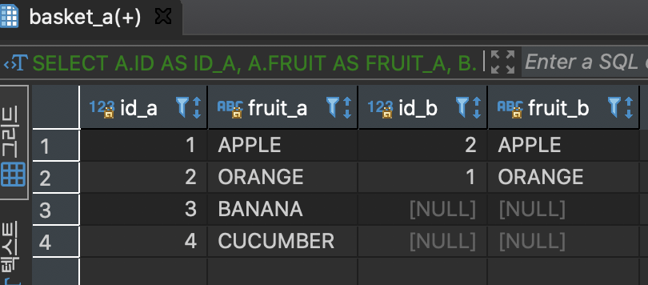

# **OUTER JOIN**

특정 컬럼을 기준으로 매칭된 집합을 출력하지만 한쪽의 집합은 모두 출력하고 다른 한쪽의 집합은 매칭되는 컬럼의 값 만을 출력


---

#### A테이블과 B테이블을 조인하는데 A를 기준집합으로 조인 (OUTER 생략 가능)

```
SELECT
	A.ID ID_A,
	A.FRUIT FRUIT_A,
	B.ID ID_B,
	B.FRUIT FRUIT_B
FROM
	BASKET_A A
INNER JOIN BASKET_B B ON
	A.FRUIT = B.FRUIT;
```


A의 데이터는 모두 가져오며 B는 중복되는 값은 보여주고 중복되는 값이 없으면 NULL로 표시

#### A의 테이블에만 존재하는 데이터를 조회(LEFT ONLY)

```
SELECT
	A.ID AS ID_A,
	A.FRUIT AS FRUIT_A,
	B.ID AS ID_B,
	B.FRUIT AS FRUIT_B
FROM
	BASKET_A A
LEFT JOIN BASKET_B B ON
	A.FRUIT = B.FRUIT
WHERE B.ID IS NULL
```
B의 테이블이 NULL인 컬럼을 조회하면 A에만 데이터가 존재


#### A테이블과 B테이블을 조인하는데 B를 기준집합으로 조인(OUTER 생략 가능)
```
SELECT
	A.ID AS ID_A,
	A.FRUIT AS FRUIT_A,
	B.ID AS ID_B,
	B.FRUIT AS FRUIT_B
FROM
	BASKET_A A
RIGHT JOIN BASKET_B B ON
	A.FRUIT = B.FRUIT
```

B의 데이터는 모두 가져오며 A는 중복되는 값은 보여주고 중복되는 값이 없으면 NULL로 표시


#### B의 테이블에만 존재하는 데이터를 조회(RIGHT ONLY)
```
SELECT
	A.ID AS ID_A,
	A.FRUIT AS FRUIT_A,
	B.ID AS ID_B,
	B.FRUIT AS FRUIT_B
FROM
	BASKET_A A
RIGHT JOIN BASKET_B B ON
	A.FRUIT = B.FRUIT
WHERE A.ID IS NULL
```

A의 테이블이 NULL인 컬럼을 조회하면 B에만 데이터가 존재


