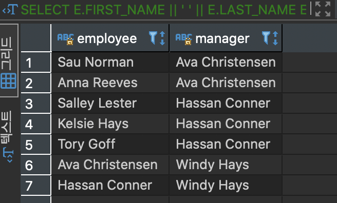
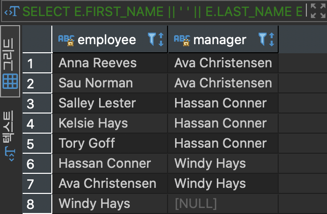
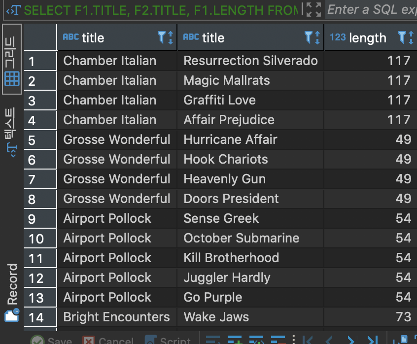
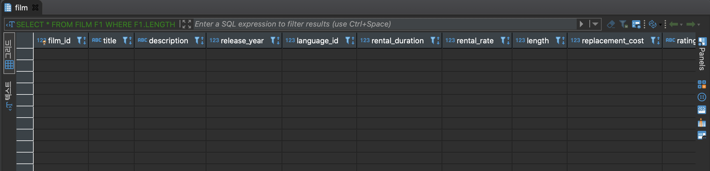

# **SELF JOIN**

같은 테이블끼리 특정 컬럼을 기준으로 매칭되는 컬럼을 출력하는 JOIN. 같은 테이블의 데이터를 각각의 집합으로 분류한 후 JOIN한다.

#### EMPLOYEE 테이블 생성
```
CREATE TABLE EMPLOYEE(
	EMPLOYEE_ID INT PRIMARY KEY,
	FIRST_NAME VARCHAR (255) NOT NULL,
	LAST_NAME VARCHAR (255) NOT NULL,
	MANAGER_ID INT,
	FOREIGN KEY (MANAGER_ID)
	REFERENCES EMPLOYEE (EMPLOYEE_ID)
	ON DELETE CASCADE
)
```

#### 데이터 저장 후 커밋
```
insert into EMPLOYEE (
	EMPLOYEE_ID,
	FIRST_NAME,
	LAST_NAME,
	MANAGER_ID
)
values
(1, 'Windy','Hays',Null),
(2, 'Ava','Christensen',1),
(3, 'Hassan','Conner',1),
(4, 'Anna','Reeves',2),
(5, 'Sau','Norman',2),
(6, 'Kelsie','Hays',3),
(7, 'Tory','Goff',3),
(8, 'Salley','Lester',3)

commit;
```

```
SELECT * FROM EMPLOYEE;
```

manager_id는 employee_id 의 하위에 포함된 직원이라고 판단 할 수 있습니다.

Windy 는 manager_id 가 null이니 최상위 관리자라 할 수 있으며 Ava,Hassan 은 manager_id가 1입니다. 즉 employee_id 1번 보다 하위의 직책 입니다. 이런식으로 조직도 관계를 데이터로 파악이 가능합니다.

#### EMPLOYEE 테이블과 EMPLOYEE 테이블을 조인, EMPLOYEE_ID 와 MANAGER_ID 컬럼을 조인

```
SELECT
	E.FIRST_NAME || ' ' || E.LAST_NAME EMPLOYEE,
	M.FIRST_NAME || ' ' || M.LAST_NAME MANAGER
FROM
	EMPLOYEE E
INNER JOIN EMPLOYEE M ON
	M.EMPLOYEE_ID = E.MANAGER_ID
ORDER BY
	MANAGER
```
 제일 상위 관리자인 MANAGER_ID 가 NULL인 직원은 JOIN할 ID값이 없어 조회 되지 않는다

 


#### EMPLOYEE 테이블과 EMPLOYEE 테이블을 조인, EMPLOYEE_ID 와 MANAGER_ID 컬럼을 조인(단 최상위 관리자도 모두 보이게 조회)

```
SELECT
	E.FIRST_NAME || ' ' || E.LAST_NAME EMPLOYEE,
	M.FIRST_NAME || ' ' || M.LAST_NAME MANAGER
FROM
	EMPLOYEE E
LEFT JOIN EMPLOYEE M ON
	M.EMPLOYEE_ID = E.MANAGER_ID
ORDER BY
	MANAGER
```


#### FILM 테이블과 FILM 테이블을 SELF 조인. 서로 다른 영화인 집합을 조회하며 영화의 상영 시간은 동일한 데이터를 조회

```
SELECT
	F1.TITLE,
	F2.TITLE,
	F1.LENGTH
FROM
	FILM F1
INNER JOIN FILM F2 ON
	F1.FILM_ID <> F2.FILM_ID
	AND F1.LENGTH = F2.LENGTH;
```



SELF JOIN을 사용하지 않을 때의 방법
```
SELECT
	*
FROM
	FILM F1
WHERE
	F1.LENGTH = F1.LENGTH
	AND F1.FILM_ID <> F1.FILM_ID;
```
값이 나올 수 없다. 동일한 테이블의 데이터를 참조하여 조회 하려면 각각의 다른 집합으로 구성한 후 그안에서 자신이 원하는 조건을 입력하여 정보를 조회헤야 함




