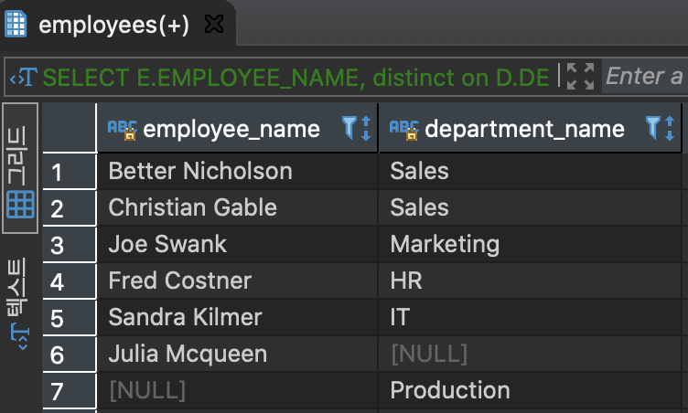

# **FULL OUTER JOIN**

INNER, LEFT OUTER, RIGHT OUTER 조인 집합을 모두 출력하는 조인 방식. 즉 두 테이블간 출력가능한 모든 데이터를 포함한 집합을 출력


#### A와 B의 테이블을 FRUIT 컬럼 기준으로 FULL OUTER JOIN


-> 7번째 집합

```
SELECT
	A.ID ID_A,
	A.FRUIT FRUIT_A,
	B.ID ID_B,
	B.FRUIT FRUIT_B
FROM
	BASKET_A A
FULL OUTER JOIN
	BASKET_B B 
ON  A.FRUIT = B.FRUIT;
```


- ID_A -> 1,2는 INNER JOIN 
- ID_A -> 3,4는 LEFT OUTER JOIN
- ID_B -> 3,4는 RIGHT OUTER JOIN

#### A와 B의 테이블을 FRUIT 컬럼 기준으로 FULL OUTER 조인, A.ID가 NULL 혹은 B.ID가 NULL인 값을 조회


-> 3번째 집합
```
SELECT
	A.ID ID_A,
	A.FRUIT FRUIT_A,
	B.ID ID_B,
	B.FRUIT FRUIT_B
FROM
	BASKET_A A
FULL OUTER JOIN
	BASKET_B B
ON	A.FRUIT = B.FRUIT
WHERE
	A.ID IS NULL
OR  B.ID IS NULL;
```

ONLY OUTER


- ID_A -> 1,2는 LEFT ONLY
- ID_B -> 3,4는 RIGHT ONLY

#### DEPARTMENTS 테이블 생성
```
CREATE TABLE
IF NOT EXISTS DEPARTMENTS
(
	DEPARTMENT_ID SERIAL PRIMARY KEY,
	DEPARTMENT_NAME VARCHAR (255) NOT NULL
)
```

#### DEPARTMENTS 데이터 추가
```
INSERT
	INTO
	DEPARTMENTS (DEPARTMENT_NAME)
VALUES ('Sales'),
('Marketing'),
('HR'),
('IT'),
('Production');

commit;
```

#### EMPLOYESS 테이블 생성
```
CREATE TABLE
IF NOT EXISTS EMPLOYEES
(
	EMPLOYEE_ID SERIAL PRIMARY KEY,
	EMPLOYEE_NAME VARCHAR (255),
	DEPARTMENT_ID INTEGER
)
```

#### EMPLOYESS 데이터 추가
```
INSERT
	INTO
	EMPLOYEES (EMPLOYEE_NAME,
	DEPARTMENT_ID)
VALUES 
('Better Nicholson',1),
('Christian Gable',1),
('Joe Swank',2),
('Fred Costner',3),
('Sandra Kilmer',4),
('Julia Mcqueen',NULL);

commit;
```

#### EMPLOYEES 테이블과 DEPARTMENTS 테이블을 FULL OUTER 조인


-> 7번째 집합

```
SELECT
	E.EMPLOYEE_NAME,
	D.DEPARTMENT_NAME
FROM
	EMPLOYEES E
FULL OUTER JOIN 
	DEPARTMENTS D
ON  D.DEPARTMENT_ID = E.DEPARTMENT_ID;
```



- INNER JOIN( 부서와 인원이 모두 있는 집합) -> 1~5라인
- LEFT JOIN( 부서가 없는 직원) -> 6라인
- RIGHT JOIN(직원이 없는 부서) -> 7라인

#### EMPLOYEES 테이블과 DEPARTMENTS 테이블을 FULL OUTER 조인(소속한 직원이 없는 부서만 출력)


-> 2번째 집합
```
-- FULL OUTER JOIN을 사용하는 방법

SELECT
	E.EMPLOYEE_NAME,
	D.DEPARTMENT_NAME
FROM
	EMPLOYEES E
FULL OUTER JOIN DEPARTMENTS D ON
	D.DEPARTMENT_ID = E.DEPARTMENT_ID
WHERE E.EMPLOYEE_NAME IS NULL;


######################################

-- RIGHT JOIN을 사용하는 방법

SELECT
	E.EMPLOYEE_NAME,
	D.DEPARTMENT_NAME
FROM
	EMPLOYEES E
RIGHT JOIN DEPARTMENTS D ON
	D.DEPARTMENT_ID = E.DEPARTMENT_ID
WHERE E.EMPLOYEE_NAME IS NULL;
```

조회되는 결과는 동일


