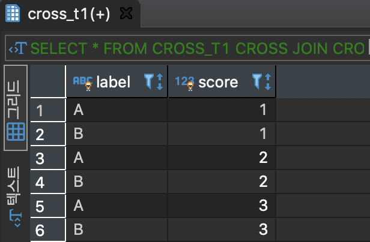
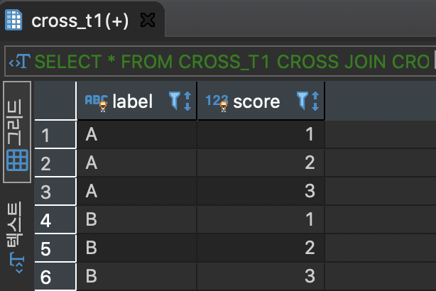

# **CROSS JOIN**

두 개의 테이블의 CATESIAN PRODUCT 연산의 결과를 출력한다. 데이터 복제에 많이 쓰이는 기법

### CATESIAAN PRODUCT(카티션 곱 또는 데카르트 곱)
- 두 집합으로부터 각각 원소를 하나씩 고른 순서쌍으로 이루어진 집합을 만들어주는 연산
- A × B = { (a, b) | a는 A의 원소, b는 B의 원소 }
- A × B = { (a, b) | a∈A ∧ b∈B }

---
#### CROSS_T1 테이블 생성
```
CREATE TABLE CROSS_T1
(
	LABEL CHAR(1) PRIMARY KEY
)
```

#### CROSS_T1 데이터 추가
```
INSERT INTO CROSS_T1 (LABEL)
VALUES
('A'),
('B');

COMMIT;
```

#### CROSS_T2 테이블 생성
```
CREATE TABLE CROSS_T2
(
	SCORE INT PRIMARY KEY
)
```

#### CROSS_T2 데이터 추가
```
INSERT INTO CROSS_T2 (SCORE)
VALUES
(1),
(2),
(3);

COMMIT;
```

#### CATESIAN PRODUCT 연산의 결과를 출력


```
SELECT
	*
FROM
	CROSS_T1
CROSS JOIN CROSS_T2;
```



#### LABEL 컬럼으로 정렬
```
SELECT
	*
FROM
	CROSS_T1
CROSS JOIN CROSS_T2
ORDER BY
	LABEL;
```


