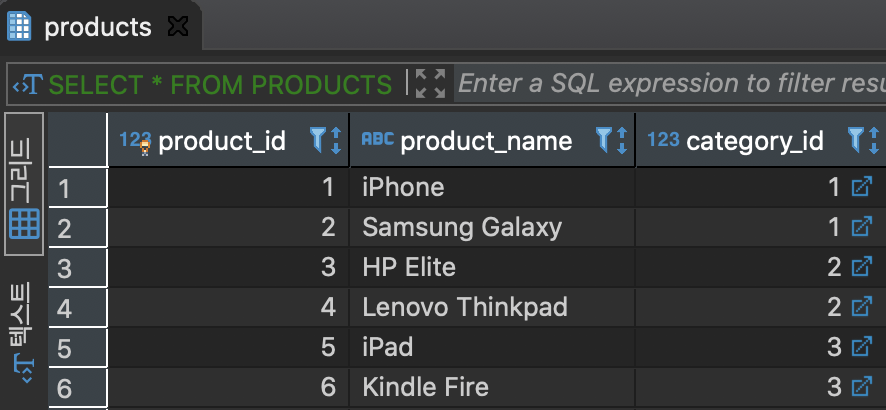
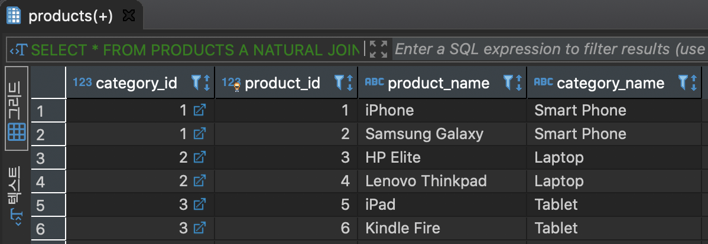

# **NATURAL JOIN**

두 개의 테이블에서 같은 이름을 가진 컬럼 간의 INNER 조인 집합 결과를 출력

#### CATEGORIES 테이블 생성
```
CREATE TABLE CATEGORIES
(
	CATEGORY_ID SERIAL PRIMARY KEY,
	CATEGORY_NAME VARCHAR (255) NOT NULL
)
```

#### CATEGORIES 데이터 추가
```
INSERT INTO CATEGORIES(CATEGORY_NAME)
VALUES
('Smart Phone'),
('Laptop'),
('Tablet');

commit;
```

#### PRODUCTS 테이블 생성
```
CREATE TABLE PRODUCTS
(
	PRODUCT_ID SERIAL PRIMARY KEY,
	PRODUCT_NAME VARCHAR (255) NOT NULL,
	CATEGORY_ID INT NOT NULL,
	FOREIGN KEY (CATEGORY_ID)
	REFERENCES CATEGORIES (CATEGORY_ID)
)
```

#### PRODUCTS 데이터 추가
```
INSERT INTO PRODUCTS
(PRODUCT_NAME,CATEGORY_ID)
VALUES
('iPhone',1),
('Samsung Galaxy',1),
('HP Elite',2),
('Lenovo Thinkpad',2),
('iPad',3),
('Kindle Fire',3)

commit;
```

```
SELECT * FROM CATEGORIES;
```

```
SELECT * FROM PRODUCTS
```


---

#### PRODUCTS 테이블과 CATEGORIES 테이블을 NATURAL 조인(이런 경우 CATEGORY_ID를 동일하게 가지고 있는 컬럼을 기준으로 INNER 조인)

```
SELECT
	*
FROM
	PRODUCTS A NATURAL
JOIN CATEGORIES B;
```

```
SELECT
	A.CATEGORY_ID,
	A.PRODUCT_ID,
	A.PRODUCT_NAME,
	B.CATEGORY_NAME
FROM
	PRODUCTS A
INNER JOIN
	CATEGORIES B
ON	A.CATEGORY_ID = B.CATEGORY_ID
```
동일 결과


