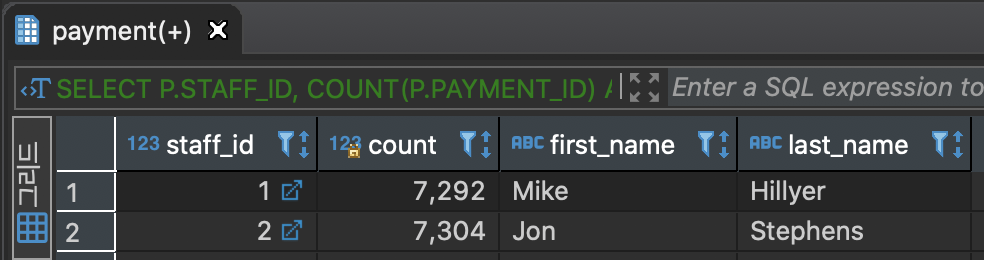

# **GROUP BY**

GROUP BY 절은 SELECT 문에서 반환된 행을 그룹으로 나눈다. 각 그룹에 대한 합계, 평균, 카운트 등을 계산할 수 있다.

```
SELECT
	COLUMN_1,
    집계함수(COLUMN_2)
FROM
	TABLE_NAME
GROUP BY COLUMN_1 
-- N개의 컬럼을 GROUP BY 하는 경우 ',' 구분
-- GROUP BY 절은 FROM 또는 WHERE절 바로 뒤에 나타나야 한다.
```

#### PAYMENT 테이블을 CUSTOMER_ID 기준으로 GROUP BY
```
SELECT
	CUSTOMER_ID -- GROUP BY 컬럼인 CUSTOMER_ID 출력
FROM
	PAYMENT -- PAYMENT 테이블 조회
GROUP BY
	CUSTOMER_ID; -- CUSTOMER_ID 기준으로 GROUP BY
```
위 결과는 아래 쿼리 결과와 동일하다.
```
SELECT
	DISTINCT CUSTOMER_ID
FROM
	PAYMENT
GROUP BY
	CUSTOMER_ID;
```

#### PAYMENT 테이블을 CUSTOMER_ID 기준으로 GROUP BY 하고 AMOUNT의 합계 값을 기준으로 내림차순 정렬

```
SELECT
	CUSTOMER_ID,
	SUM(AMOUNT) AS AMOUNT_SUM
FROM
	PAYMENT
GROUP BY
	CUSTOMER_ID
ORDER BY
	SUM(AMOUNT) DESC;
    
-- 동일한 방법

SELECT
	CUSTOMER_ID,
	SUM(AMOUNT) AS AMOUNT_SUM
FROM
	PAYMENT
GROUP BY
	CUSTOMER_ID
ORDER BY 2 DESC;
```

#### PAYMENT 테이블을 STAFF_ID 기준으로 PAYMENT_ID의 카운트를 조회하며 STAFF_ID 기준으로 GROUP BY

```
SELECT
	STAFF_ID,
	COUNT(PAYMENT_ID) AS COUNT
FROM
	PAYMENT
GROUP BY
	STAFF_ID;
```

#### 위 결과에서 STAFF 이름까지 조회
```
SELECT
	P.STAFF_ID,
	COUNT(P.PAYMENT_ID) AS COUNT,
	S.FIRST_NAME,
	S.LAST_NAME
FROM
	PAYMENT P,
	STAFF S
WHERE
	P.STAFF_ID = S.STAFF_ID
GROUP BY
	P.STAFF_ID,
	S.STAFF_ID,
	S.FIRST_NAME,
	S.LAST_NAME;
```

